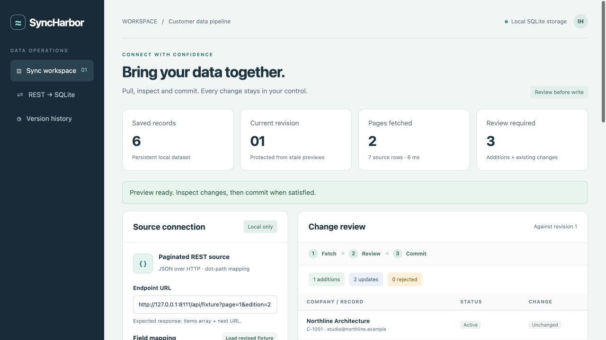
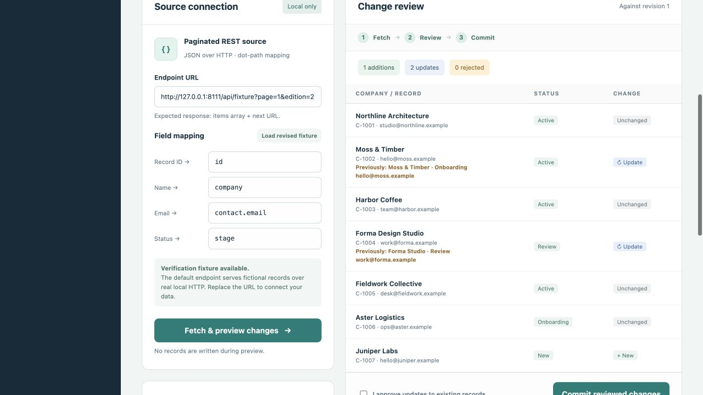

# SyncHarbor — Reviewable REST Data Synchronization

A working local application for importing paginated JSON from an HTTP endpoint into a persistent SQLite dataset. It maps source fields, previews additions and modifications, requires approval for updates, detects stale reviews, and keeps recovery snapshots.

An independent project by Ismail Habib. Screenshots show the running application; any records shown are labelled verification data.

## Screenshots



Two-page HTTP source and field mapping in the running synchronization workspace.



A revised source proposes one addition and two modifications for review before commit.

## Features

- Real paginated HTTP imports with nested source-field mapping.
- Before/after previews and explicit approval of updates.
- Atomic SQLite commits, revision checks and reversible recovery snapshots.
- Persistent activity history and CSV/JSON exports.

## Quick start

Run these commands from the repository directory.

Requires Python 3.11 or newer. No third-party packages are required.

```sh
python3 app.py
```

Open **http://127.0.0.1:8111**. On Windows use `py -3 app.py`. `run.sh` is an equivalent macOS/Linux launcher. Stop with Ctrl+C. The app binds only to loopback. To change the port, set `PORT`; the default fixture URL adapts automatically.

SQLite data is created at `data/syncharbor.sqlite3`. Override its location with `SYNCHARBOR_DB`. Stop the application before copying this database for a backup. Source credentials are not needed for the included workflow.

## Complete first workflow

1. Keep the default local verification endpoint and field mapping.
2. Choose **Fetch & preview changes**. The application makes two HTTP requests and proposes six additions. Nothing is written to the dataset yet.
3. Choose **Commit reviewed changes**. Six records are stored and recovery points are created.
4. Choose **Load revised fixture**, then **Fetch & preview changes**. Edition 2 contains one additional record and two modified records.
5. Inspect the changes, check **I approve updates to existing records**, and commit. The database now contains seven records.
6. Download CSV or JSON from **Saved dataset**.
7. Restore a recovery point. The state that existed before restoration is also saved, making the restore reversible.

A preview becomes unusable if another import or restore changes the dataset. Fetch a new preview in that situation. Previews live in memory for up to 30 minutes and disappear when the application restarts. Saved records, recovery points and the activity log persist across restarts.

## Connect an actual endpoint

Return JSON in this shape:

```json
{
  "items": [
    {"id": "A-123", "company": "Your company", "contact": {"email": "ops@example.com"}, "stage": "Active"}
  ],
  "next": "/customers?page=2"
}
```

The final page must set `next` to null or omit it. Relative and absolute pagination URLs are accepted only on the original origin. Every item must be an object. Each mapped path must exist; `external_id` and `name` must be nonempty scalar values. Nested object fields use dot notation. Source records absent from a later import are **retained**, not deleted.

To allow fetching remote HTTPS endpoints, explicitly start with:

```sh
ALLOW_REMOTE_FETCH=1 python3 app.py
```

Remote HTTP additionally requires `ALLOW_INSECURE_HTTP=1`. This application has no OAuth flow or credential storage; use accessible endpoints or a separately managed adapter. Do not put confidential access tokens in URLs: source URLs are displayed and retained in the activity log. Redirects are rejected. No external calls occur by default.

## Behavior and boundaries

- SQLite transactions make each commit and restore atomic. An optimistic revision check prevents stale previews from replacing more recent data.
- Duplicate source IDs with differing values, missing mapped fields and nonscalar values block the entire commit. Identical duplicates collapse to one record.
- Changes to existing records require an explicit approval flag. The before/after values are visible in the review.
- An import is limited to 20 pages, 5,000 rows and 2 MB per page. HTTP socket timeout is at most six seconds per request, with a 25-second budget checked between requests. Socket timeout is an inactivity limit, not a strict wall-clock deadline against a continuously streaming server.
- Preview tokens are bounded to 30 retained entries and expire after 30 minutes. Recovery snapshots remain in the SQLite database; the interface lists the latest 30.
- CSV exports neutralize common spreadsheet formula prefixes. JSON exports preserve original values.
- Host and Origin checks protect this loopback interface. This is a single-user local tool; it has no login, TLS termination, shared-user authorization or deployment hardening.
- Only the documented `items`/`next` pagination envelope and four canonical fields are supported. Arbitrary API schemas and OAuth need adapters.
- There is no scheduler, background sync, writeback to the source, or source-side deletion propagation.

## API

| Route | Purpose |
|---|---|
| `GET /api/state` | Records, revision, recent snapshots and activity |
| `POST /api/preview` | JSON `{url, mapping}`; returns token and review |
| `POST /api/commit` | JSON `{token, allow_updates}` |
| `POST /api/restore` | JSON `{snapshot_id, expected_revision}` |
| `GET /api/export.csv` | Spreadsheet-safe CSV |
| `GET /api/export.json` | JSON records |
| `GET /api/fixture?page=1&edition=1` | Clearly labeled fictional HTTP fixture |

JSON POSTs are required. Unknown Host or cross-origin Origin headers are rejected.

## Verify

```sh
python3 -m unittest -v test_app.py
```

The tests bind a temporary loopback HTTP server and use temporary databases. They never modify `data/`. See `TEST_RESULTS.md` and the captured `test-run.txt` for the actual local run.

## Portfolio files

- `CASE_STUDY.md`: problem, implementation, evidence and scope.
- `MALT_COPY.md`: ready-to-use title and client-focused portfolio description.
- `portfolio_metadata.json`: machine-readable catalogue details.
- `screenshots/`: screenshots captured from the running application.
- `PORTFOLIO.pdf`: packaged case study, generated during portfolio assembly.

No videos are included.

## License

[MIT License](LICENSE) — Copyright (c) 2026 Ismail Habib.
